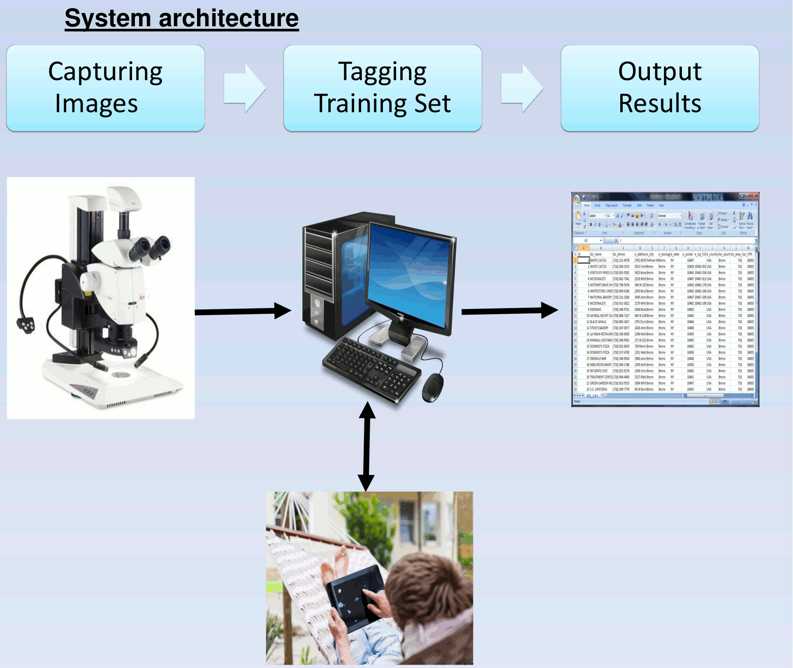

# PiTex
PiTex is a tool aimed to help Ecologists classify and count [<i>Foraminifera</i>](https://en.wikipedia.org/wiki/Foraminifera) from images obtained by microscope, using <i>Machine Learning, Computer Vision</i> and other tools.

## Dependencies:

1. numpy & scipy (http://www.numpy.org, http://www.scipy.org)

2. opencv (http://opencv.org/)

3. scikit-learn (http://scikit-learn.org/stable/install.html)

## System Architecture:

## Results on Dataset:
|Dataset|Positive|Negative|TN|TP|FN|FP|Parameters|
|-------|--------|--------|--|--|--|--|----------|
|Palmahim1|56|12,350|9,876 (80%)| 55 (99%)| 1 | 2047| Kernel:Polynomial, Degree:2, C:10^-5, Gamma:1|
|Palmahim1|56|12,350|10,259 (84%)| 45 (83%) | 10 | 2091| Kernel: Polynomial, Degree: 2, C: 10^-4, Gamma:1|
